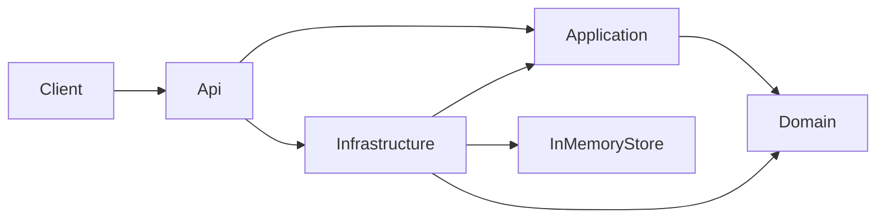
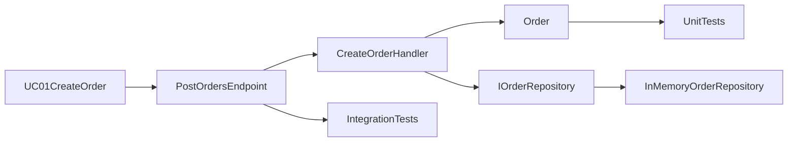

# Przeglad architektury systemu

## Cel systemu

System pokazuje minimalny, ale dzialajacy przyklad projektu warstwowego w .NET. Celem jest zachowanie czytelnego przeplywu od przypadku uzycia do implementacji bez nadmiernej zlozonosci.

---

## Styl architektury

Szablon korzysta z lekkiego podejscia inspirowanego **Clean Architecture**:

- logika biznesowa pozostaje w `Domain`,
- przypadki uzycia sa realizowane w `Application`,
- `Api` sklada aplikacje i wystawia endpointy,
- `Infrastructure` implementuje szczegoly techniczne.

Najwazniejsza zasada: logika biznesowa nie powinna zalezec od szczegolow infrastruktury.

---

## Diagram zaleznosci

W tym ukladzie `Api` zna warstwe `Infrastructure`, bo to tutaj odbywa sie kompozycja zaleznosci. `Domain` nie zalezy od `Infrastructure`.

---

## Mapowanie dokumentacji na kod

Referencyjny przeplyw dla `UC-01` wyglada tak:

To jest podstawowy wzorzec przeplywu dla aktualnej implementacji.

---

## Warstwy systemu

### API

Warstwa komunikacji z klientem.

Zawiera:

- endpointy HTTP,
- mapowanie zadan na przypadki uzycia,
- skladanie zaleznosci.

### Application

Warstwa realizujaca przypadki uzycia systemu.

Zawiera:

- komendy i modele odpowiedzi,
- handlery use case,
- kontrakty potrzebne do wspolpracy z infrastruktura.

### Domain

Warstwa modelu domenowego i reguly biznesowych.

Zawiera:

- agregat `Order`,
- element `OrderItem`,
- enum `OrderStatus`.

### Infrastructure

Warstwa szczegolow technicznych.

Obecnie zawiera prosta implementacje repozytorium w pamieci. To pozwala utrzymac niski poziom zlozonosci przy zachowaniu czytelnej struktury.