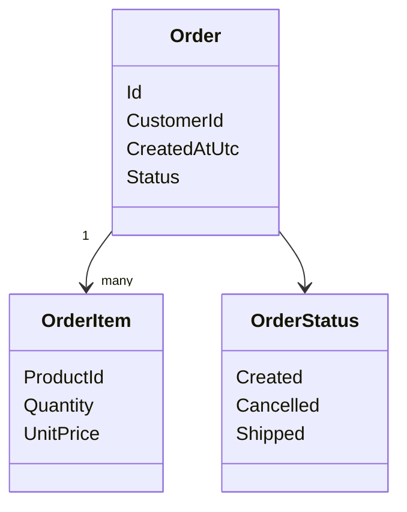

# Model domenowy

## Opis domeny

Przyklad dotyczy prostego systemu do zarzadzania zamowieniami klientow. Obecna implementacja obejmuje pierwszy pionowy wycinek: utworzenie zamowienia.

Kazde zamowienie sklada sie z jednej lub wielu pozycji. Na potrzeby prostego startu dane produktu sa przechowywane bezposrednio w pozycji zamowienia przez `ProductId` i `UnitPrice`.

---

## Diagram klas

---

## Elementy modelu

### Order

Agregat reprezentujacy zamowienie klienta.

Odpowiada za:

- utworzenie poprawnego zamowienia,
- przechowanie listy pozycji,
- pilnowanie statusu zamowienia.

Glowne atrybuty:

- `Id`
- `CustomerId`
- `CreatedAtUtc`
- `Status`
- `Items`

### OrderItem

Pojedyncza pozycja zamowienia.

Glowne atrybuty:

- `ProductId`
- `Quantity`
- `UnitPrice`

W obecnej wersji pozycja zawiera dane wystarczajace do opisania logiki biznesowej bez budowania osobnego modulu katalogu produktow.

### OrderStatus

Prosty enum opisujacy stan zamowienia:

- `Created`
- `Cancelled`
- `Shipped`

---

## Relacje

- `Order` zawiera wiele `OrderItem`.
- `OrderStatus` opisuje aktualny stan `Order`.

---

## Zasady biznesowe

- zamowienie musi miec klienta,
- zamowienie musi miec co najmniej jedna pozycje,
- ilosc i cena w pozycji musza byc wieksze od zera,
- wyslanego zamowienia nie mozna anulowac.
